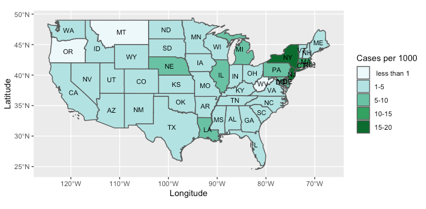

# Mapping COVID-19

The New York Times provides state and county level data about
COVID-19 cases at https://github.com/nytimes/covid-19-data. The R
Markdown files here discuss approches to discritize the data and
plot both static maps using ggplot and somewhat interactive webmaps
created using the Leaflet and OpenLayers libraries. The main
motivation is to discuss some elementary principles of 'objective'
map making with the mapping functionalities of R and QGIS in the
context of COVID-19 data. Accompanying slides provide some conceptual
background. As we saw in the workshop, if you want to have a pop-up
showing temporal profile of COVID cases for each state (or county),
resize your image (make thumbnails) so that they are easy to display. The two maps below show numbers upto May 17th, 2020. 

[An interactive map showing case count and case ratio per 1000
persons](https://manishverma09.github.io/Mapping-COVID-19/image/covid_state.html) 

I will add more material realted to bivariate and multivariate maps
sometime soon.
